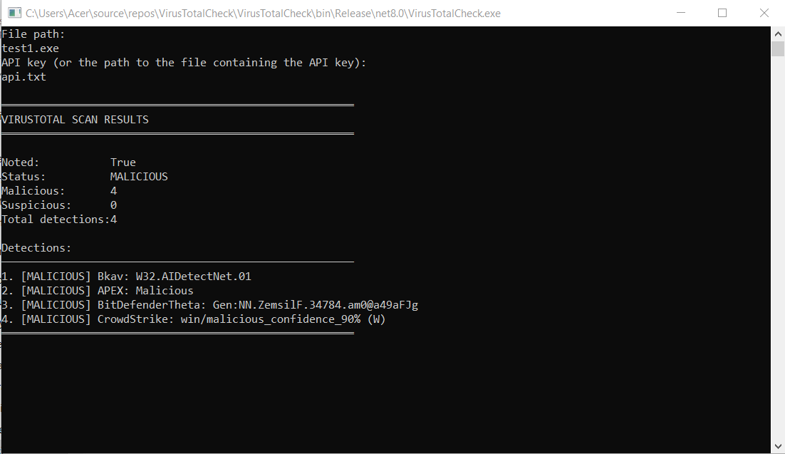
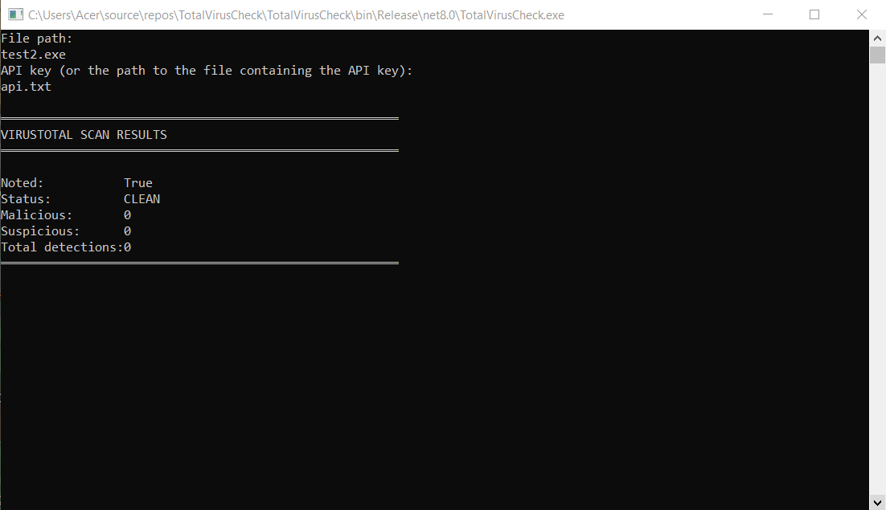

# VirusTotalCheck
A simple console scanner sending file to VirusTotal API and displays the results.
Created for Education

### Use:

```cmd
VirusTotalCheck.exe "C:\file.exe" "******..."
```
```cmd
VirusTotalCheck.exe "file.exe" "api.txt"
```

or just run the program and it will ask you for data in the console

### Example:



